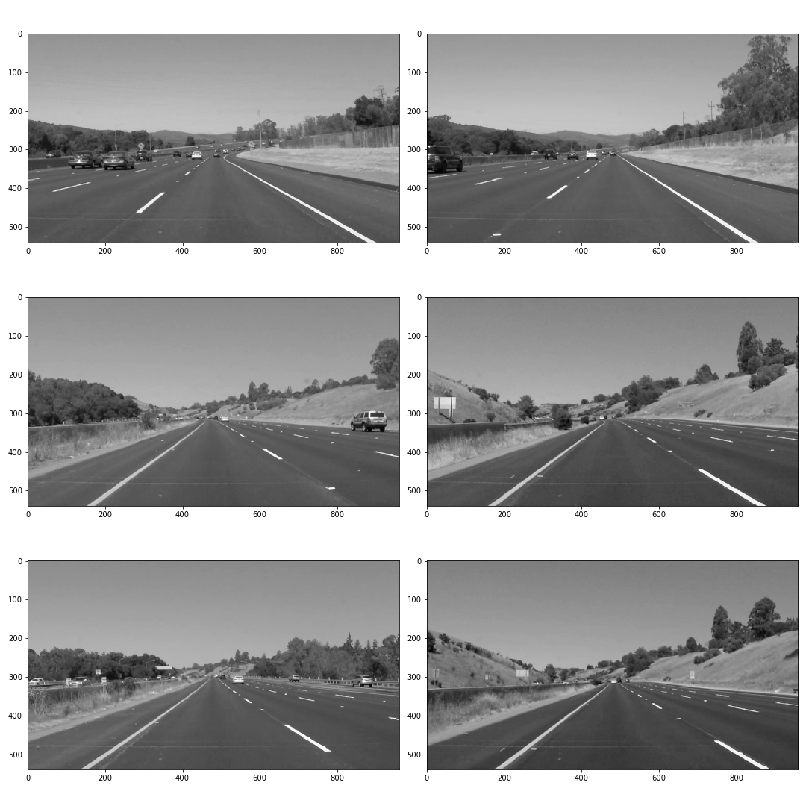
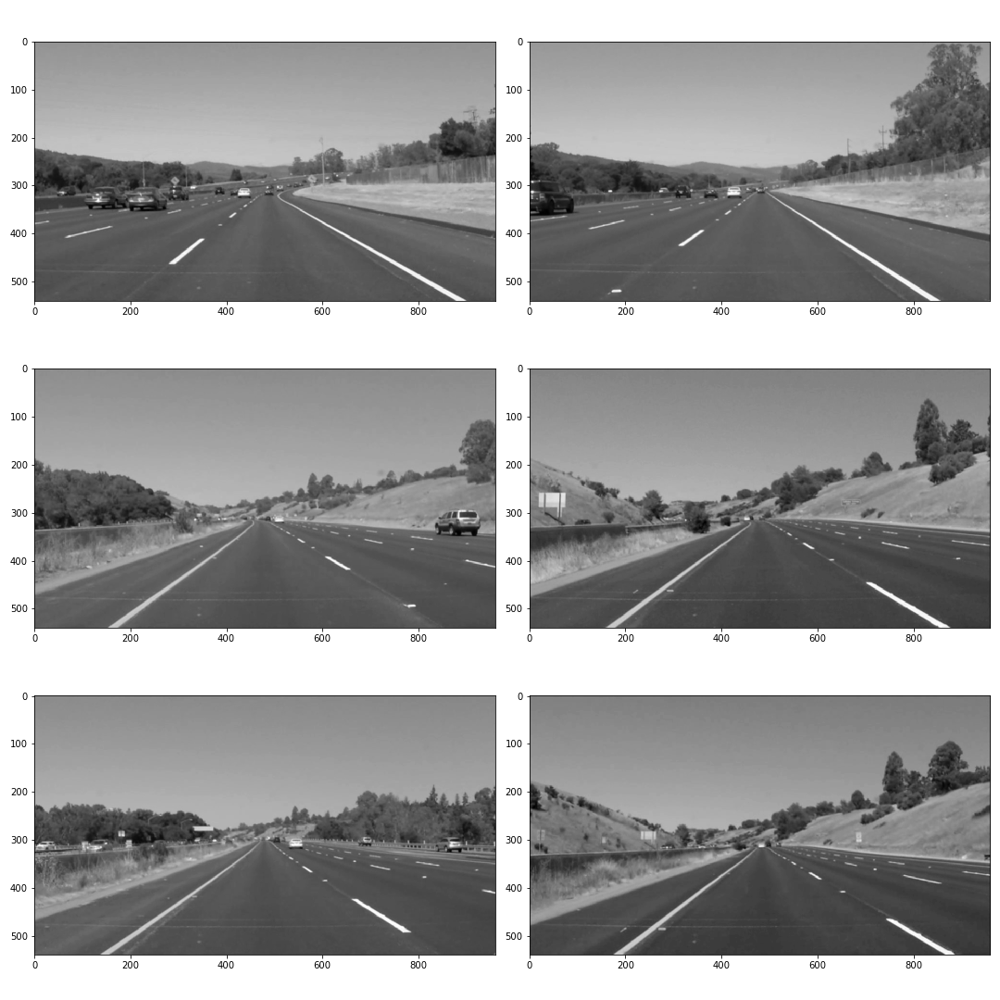
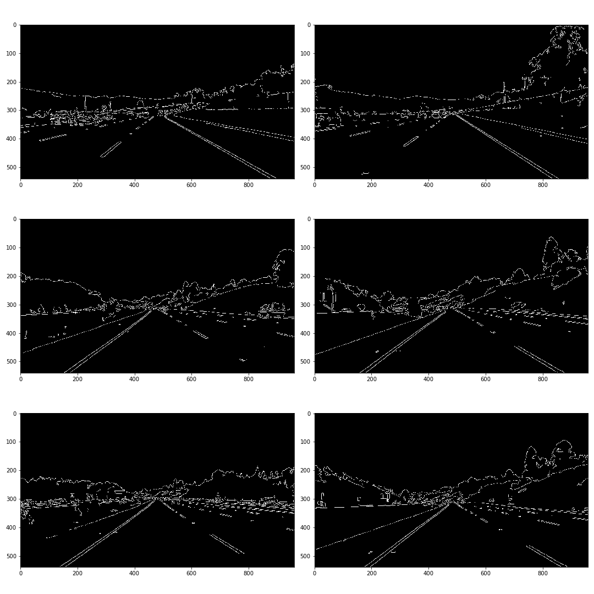
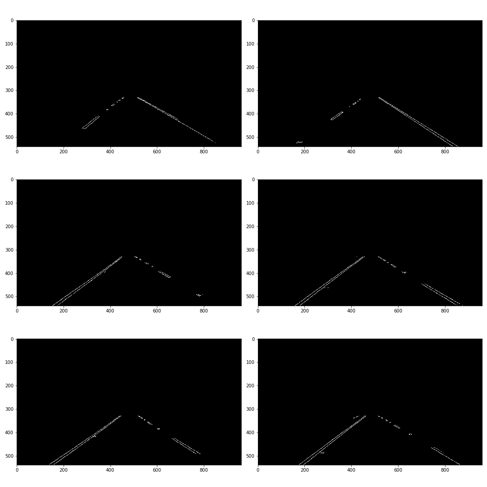
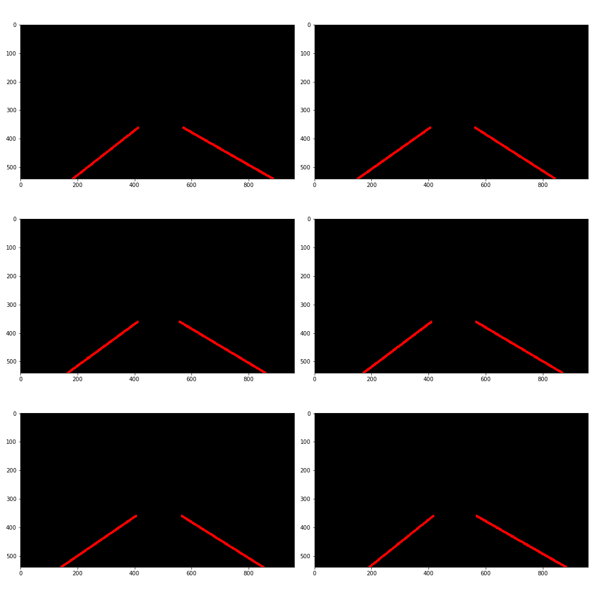
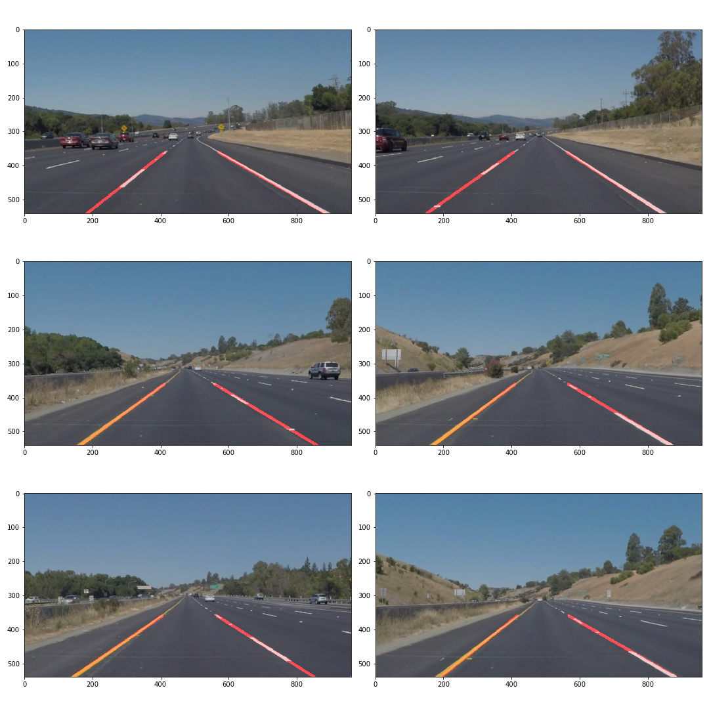

# **Finding Lane Lines on the Road** 
[image1]: ./test_images_output/solidYellowCurve.jpg "Grayscale"

## Overview
When we drive, we use our eyes to decide where to go. The lines on the road that show us where the lanes are act as our constant reference for where to steer the vehicle. Naturally, one of the first things we would like to do in developing a self-driving car is to automatically detect lane lines using an algorithm.

In this project you will detect lane lines in images using Python and OpenCV. OpenCV means "Open-Source Computer Vision", which is a package that has many useful tools for analyzing images.


---
## Prerequisites

* Miniconda or Anaconda with Python >= 3.7 (if you haven't already. Set up the [Anaconda](https://www.anaconda.com/distribution/)  )
* Jupyter Notebook
---

## Dependencies & Environment Setup:  

   - numpy for array, list, matrix operations
   - matplotlib.pyplot for plotting & show images
   - cv2 for basic computer vision operations ( OpenCV  )
   - moviepy for capturing video frame as an image 

For creating an environment: Open the conda terminal & type
``` 
conda create -n carnd-term1 python=3.7
```
``` 
activate carnd-term1
```
``` 
conda install -c conda-forge notebook numpy moviepy matplotlib opencv
```
``` 
jupter notebook
```

Open the [P1.ipynb](P1.ipynb)  file and run it step by step 

---

### Pipeline:


Pipeline consisted of 6 steps. 
* First, Colored images has 3 layers/channels so it has height x width x 3 size data so I converted the images to grayscale for reduce channel count.

```python 
def grayscale(img):    
    return cv2.cvtColor(img, cv2.COLOR_RGB2GRAY)

gray_image = grayscale(image)
```



* Captured images may have distortion or noisy data so we are us'ng gaussian blur function with kernel size = 3. 
```python 
def gaussian_blur(img, kernel_size):
	return cv2.GaussianBlur(img, (kernel_size, kernel_size), 0)

gaussian_blur_image = gaussian_blur(gray_image, 3)
```



* For detecting image edges (feature) we are using Canny Edge Detection 
```python 
def canny(img, low_threshold, high_threshold):
    return cv2.Canny(img, low_threshold, high_threshold)

canny_edges = canny(gaussian_blur_image, 50, 150)
```



* Region of interest: this area eliminates the unwanted sight of image like clouds, top left, top right etc...
```python 
def region_of_interest(img, vertices):
    mask = np.zeros_like(img)   
    if len(img.shape) > 2:
        channel_count = img.shape[2]  
        ignore_mask_color = (255,) * channel_count
    else:
        ignore_mask_color = 255
    cv2.fillPoly(mask, vertices, ignore_mask_color)
    masked_image = cv2.bitwise_and(img, mask)
    return masked_image

vertices = np.array([[(130,imshape[0]),(imshape[1]//2 - 60, 330), (imshape[1]//2 + 60, 330),(imshape[1] - 85,imshape[0])
roi_image = region_of_interest(canny_edges, vertices)
```


* We know the line equation y=mx+b from high school math. For detecting slope and intercept and get avarage slope and intercept and find the best left & right line
```python 
def hough_lines(img, rho, theta, threshold, min_line_len, max_line_gap):
this function is too long so you can read in P1.ipynb


rho = 2 # distance resolution in pixels of the Hough grid
theta = np.pi/180 # angular resolution in radians of the Hough grid
threshold = 30     # minimum number of votes (intersections in Hough grid cell)
min_line_length = 20 #minimum number of pixels making up a line
max_line_gap = 10    # maximum gap in pixels between connectable line segments

hough_image = hough_lines(roi_image, rho, theta, threshold, min_line_length, max_line_gap)
```


* At the end we apply detected lane line to initial image with opencv draw line method.
```python 
def weighted_img(img, initial_img, α=0.8, β=1., γ=0.):
    return cv2.addWeighted(initial_img, α, img, β, γ)
result = weighted_img(image, hough_image )
```



In order to draw a single line on the left and right lanes, I modified the draw_lines() function. Remember, y = mx + b is a line equation. m is slope and b is intercept. In draw_lines we calculate avarage slope because there are lots of line so so many slope and intercept. Also remember if slope < 0 the line is represented by left line otherwise line is right line. And we define a horizon for y value restirect for cloud and unwanted sky area.
np.polyfit() function gives us slope & intercept.

At the end of this process we combine the pipeline in process_image function.

![alt text][image1]

### 2. Potential shortcomings with current pipeline

Pipeline could handle straight line. If pipeline face off any bad scenario, pipeline will not work. For example it could not work when lanes has curve or  it may be left line exist but right lane does not exist or both of them does not exist. When night or evening it would not work.  


### 3. Suggest possible improvements to pipeline

A possible improvement would be to use quadratic formulas for getting curve parameters.

Another potential improvement could be constants, for example Canny Edge Detection, ROI, HoughLinesP parameters can be adjusted automatically according to the day and night position.